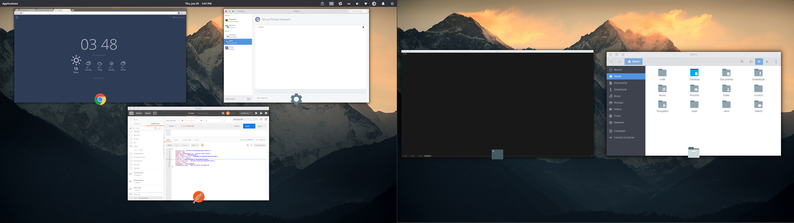
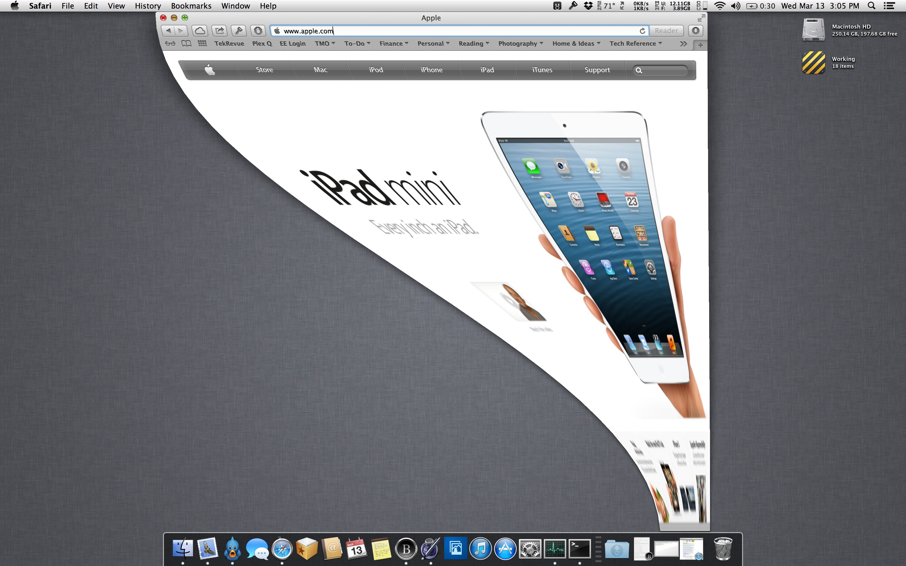

**Disclaimer:** I have been using elementary OS for a while now. It’s mostly
great, but the alt+tab functionality gets under my skin. My level of
frustration has been enough to send me Googling for ways to change the default
behaviour, but not enough to do anything constructive about it. I suppose this
should end up as a [“Needs design”
issue](https://github.com/search?utf8=%E2%9C%93&q=is%3Aopen+is%3Aissue+user%3Aelementary+label%3A%22Needs+Design%22),
but at the time of this post I happened to feel like ranting, so I did that
instead. Below is that rant — you have been warned. It details some specifics
about why I think alt+tab in elementary OS is broken.

## The search for a fix

First of all, there are plenty of complaints about this. There didn’t seem to
be any solutions on the discussions I found, but what disappointed me was that
in many of those threads, the responses were defensive — comments like “I don’t
really know why you would want something other than what we have now”.

Seriously? From my perspective, alt+tab switching is hands down the worst part
of elementary OS. It frustrates me *literally* every time I use it. I’d say
that from a UX standpoint, it breaks continuity in more than one big way.

For reference, below is a short video of me switching through a typical set of
open windows.

<iframe width="560" height="315"
src="https://www.youtube.com/embed/ta7itUYlLvk" frameborder="0"
allowfullscreen></iframe>

## The dock in general

I appreciate the idea of overloading the dock, and I think it could work, but
It needs more design. Plank only shows you the currently open apps while
alt-tabbing, and this can be jarring if the number of apps you have open is
very different from the number you have pinned.

In the extreme case, when you alt+tab your “dock” suddenly looks very different
— so much so that it takes my brain a split second to register it as “my dock”.
This is confusing because although the two different modes provide completely
different functionality, they look *kind of* the same. I mean this in the sense
that they are both in the same area of the screen and have the same background,
but show a different list of apps and have different widths. The change in
width is the real culprit for me here — I have many apps pinned, so if I only
have three or four apps open, hitting alt+tab makes my dock do a vanishing act.
This confusion is compounded by the fact that I auto-hide my dock.

If it was my choice, I would either stop overloading the dock or make it work
more like the current alt+esc functionality (except of course it would cycle
through all apps instead of the most recent two).

## The window fly-in/out animations

I like animations which are applied tastefully and don’t get in the way. But
let’s look at what the alt-tab switcher is supposed to do…

In my opinion, alt+tab should be a quicker version of the window
overview/expose/super+a. I should be able to get a quick, general overview of
how many things I have open, and at a glance be able to tell how many times I
should tap tab to get to the one I want. If the number of open apps is small
enough, the first time I cycle through them should provide me with a mental
model of their order, so next time I know how many times to cycle without even
having to see the list.

Having an animation as grand as the current one breaks any mental model that I
have in my head. It’s generally disorienting, and worse, the chosen animation
makes it look like the apps are moving (coming and going from the centre of the
screen) as you cycle. I don’t want to have to do extra work by trying to
mentally block out the animation to keep my mental model consistent.

I know it’s for a different operation, but a good example of how to to this
properly is the minimize/maximize animation in the macOS dock.

They use an animation that goes out of its way to map how the app fits into the
bigger picture.

The fly-in/out animation on elementary OS does the opposite — it provides no
actual value, and just adds more cognitive load.

## Multi-monitor

This one is really simple.

**A)** Plank on elementary defaults to having one dock — on the main screen

**B)** Plank is used as the alt+tab switcher

I don’t disagree with either of these choices, but they can’t be used together.
Pick one and move on from there.

I primarily use two screens. It takes mental load to go through the cycle:

* hit alt+tab

* get confused

* lose my train of thought while trying to grok my screen

* remember how it works

* move away from where I was working to look at the bottom of the main screen

* etc.

## Smaller things

As far as I know, there’s no equivalent of alt+\` from other desktops. It would
be cool if I could cycle between windows of the same app, on multiple screens,
etc. Not a deal-breaker though.

Also, alt+tab with one window open makes the screen flash.

/rant

## P.S.

Here are some resources if anyone is interested.

* [https://github.com/tom95/gala-alternate-alt-tab](https://github.com/tom95/gala-alternate-alt-tab)

* [https://code.launchpad.net/~gala-dev/gala/no-depth-alt-tab](https://code.launchpad.net/~gala-dev/gala/no-depth-alt-tab)

Both of these were last updated two years ago. I didn’t try either, so if
anyone has had a positive experience with them in Loki I’d be interested to
know.
